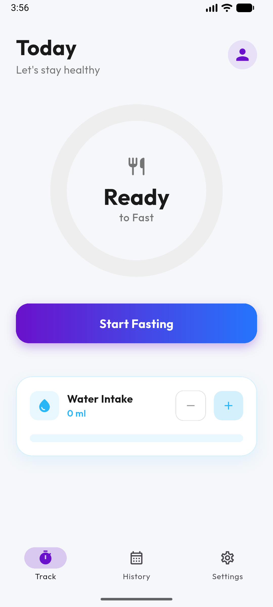
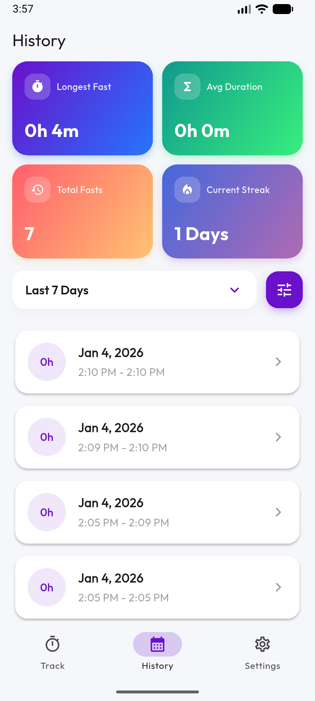
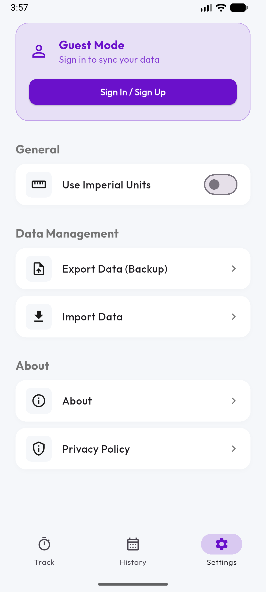

# Simple Fast Tracker

A privacy-focused intermittent fasting tracker built with Flutter.

## Screenshots

  
  
  

## Features

- **Privacy First**: Choose between "Guest Mode" (Local Only) or "Signed In" (End-to-End Encrypted Cloud Sync).
- **Offline Capable**: All data is stored locally first using Hive.
- **Secure**: Sensitive data (Start Time, Duration, Notes) is encrypted before leaving your device.
- **Data Portability**: Export and Import your data securely with a passkey.
- **Beautiful UI**: Modern, clean, and responsive design using the Outfit font family.

## License

**Non-Commercial License**

This software is free for **personal use only**.

By downloading, installing, or using this software, you agree to the following terms:
1.  **No Commercial Use**: You may not use this software for any commercial purpose, including but not limited to selling it, incorporating it into a commercial product, or using it to generate revenue.
2.  **No Redistribution for Profit**: You may not distribute this software or any derivative works for a fee.

For commercial licensing inquiries, please contact the author.
